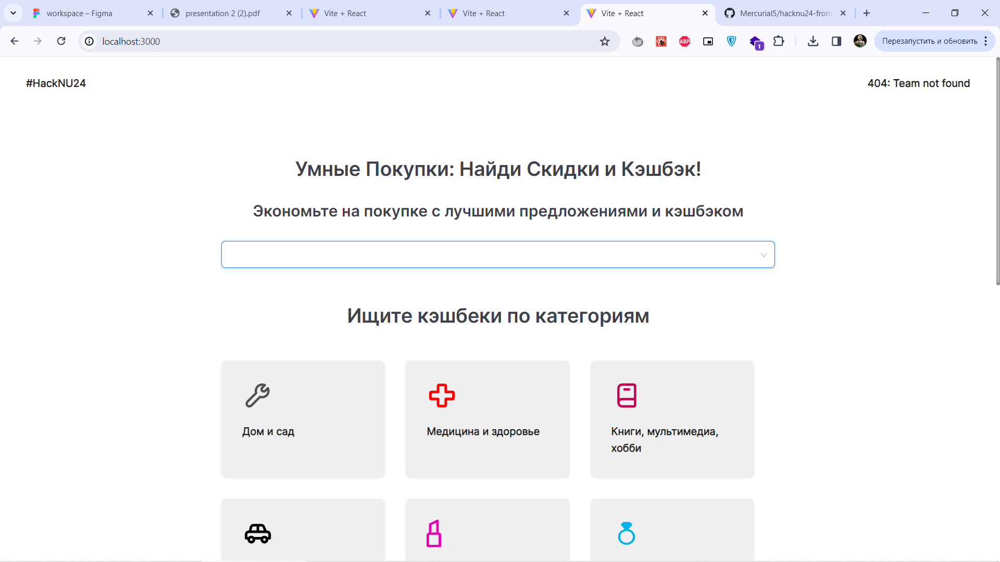
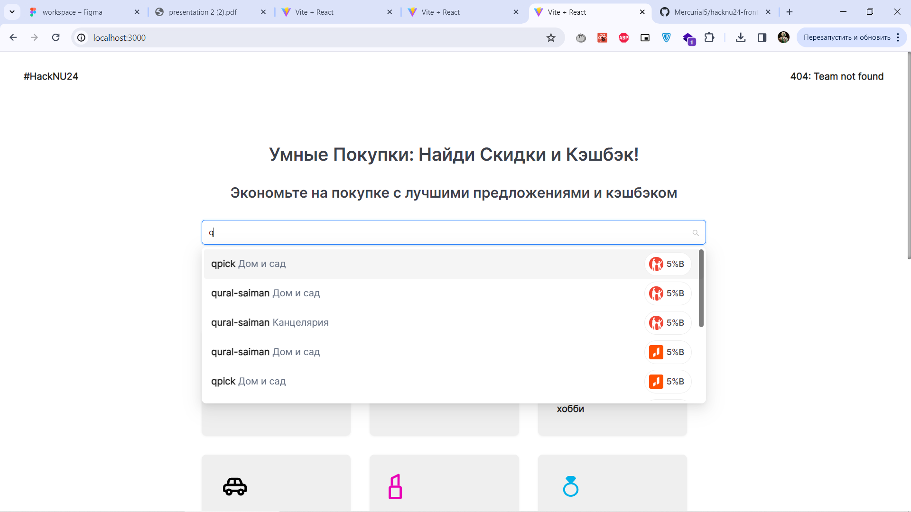
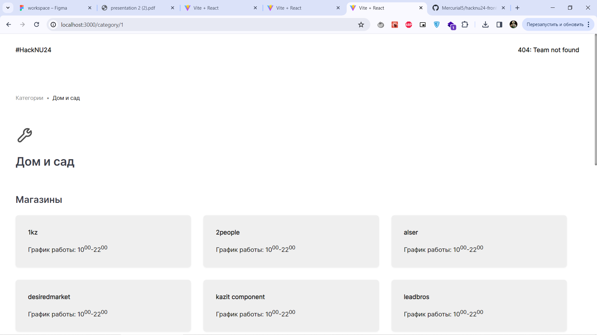
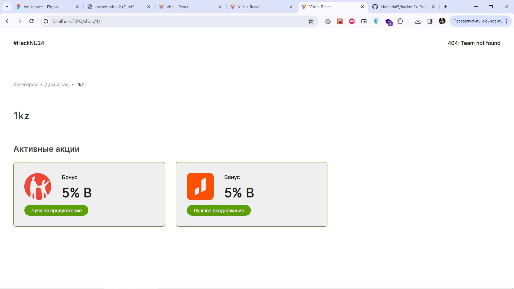
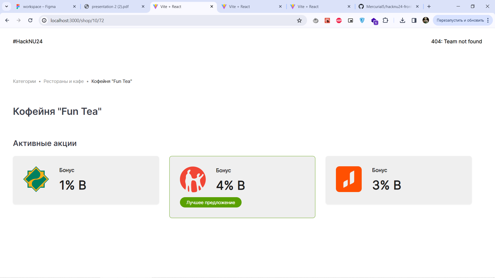
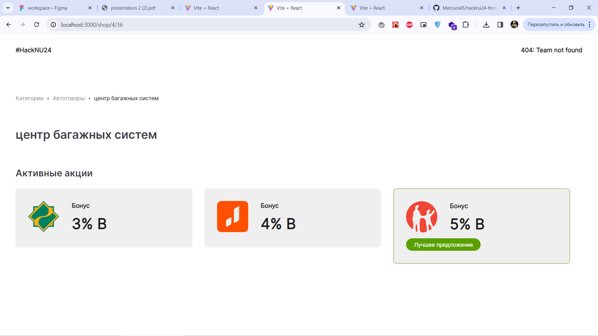

# 404: Team not Found (BTS case)


[//]: # (## Description)

[//]: # ()
[//]: # (It's a web application that allows users to manage problems in your Residential complex by creating applications to fix the problem and having access to your home's financial reports.)

[//]: # ()
[//]: # (The technical task was provided by [Kolesa Group]&#40;https://kolesa.group/&#41;, during [_Developer Hackathon_]&#40;https://the-tech.kz/v-karagande-projdet-trehdnevnyj-developer-hackathon/&#41;.)

[//]: # ()
[//]: # ([Link to the Backend Repository]&#40;https://github.com/Bioneisme/devhack-hackthon&#41;)

[//]: # (## Features:)

[//]: # ()
[//]: # (- JWT Authentication with refresh tokens)

[//]: # (- Integrated Redux for state management)

[//]: # (- Layout and UI with Ant Design)

[//]: # (- Simple Modular Architecture &#40;Modules -> Pages&#41;)

## Getting Started

It's mandatory to install [NodeJS](https://nodejs.org/en/download/). After open the command line.

- Clone the latest version
```
 git clone https://github.com/Mercurial5/hacknu24-frontend
```
- Change directory to project's folder
```
 cd hacknu24-frontend
```
- Install dependencies
```
 npm install
```
- Run project
```
 npm start
```
Now, web-application is running on http://localhost:3000/ or another port that must be mentioned on the command line.






